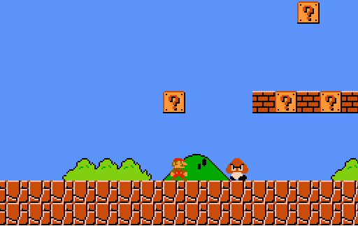

# Super Mario using OpenGL

**v0.01**  
Super Mario Game implemented in C++ using OpenGL and SDL.

[Find the repository here](https://github.com/t0xic0der/opengl-mario)

<p align="center">
    
    
    
    
</p>



## Prerequisites
You need `freeglut` and `SDL` libraries. 

## Fedora users
In order to install dependencies, execute the following
``` bash
$ chmod +x fedora-dep.sh
$ ./fedora-dep.sh
```

## Ubuntu users
In order to install dependencies, execute the following
``` bash
$ chmod +x ubuntu-dep.sh
$ ./ubuntu-dep.sh
```

### Usage
``` bash
$ git clone https://github.com/t0xic0der/opengl-mario 
$ cd opengl-mario/src
$ make
$ ./mario
```
