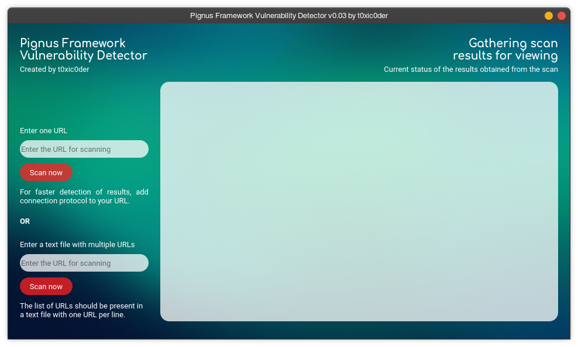

# Pignus Framework Vulnerability Detector
**Version 0.03**  
A Python GUI application for scanning websites for their frameworks and detecting vulnerabilities off them.

[Find the repository here](https://github.com/t0xic0der/pignus-framework-vulnerability-detector)

## Usage 
1. Install and upgrade **virtualenv** if not already done by executing ```pip3 install virtualenv --user```
2. Clone the repository on your local drive and make it your current working directory.
3. Create a virtual environment by executing ```virtualenv venv```
4. Activate the virtual environment by executing ```source venv/bin/activate```
5. Install all dependencies for the project by executing ```pip3 install -r requirements.txt```
6. Run the project by executing ```python3 fwvulgui.py```
7. Scan URLs for framework one-by-one by typing them in the textbox.
8. Scan URLs for framework in a batch by indicating a text file storing them linewise.
9. When done tinkering, deactivate the virtual environment by executing ```deactivate```
0. Give stars to the repository if it was helpful

## To-do
- `COMPLETED!` Build GUI and prototype UX for loopholes
- `COMPLETED!` Add scanning function for single URL through text entry
- `COMPLETED!` Add scanning function for multiple URLs through file reading
- `COMPLETED!` Add timer function to note the duration for scanning
- `COMPLETED!` List down all tracked frameworks
- `COMPLETED!` Add clear button for all line edit boxes
- `INCOMPLETE` Add file picker module for text files
- `INCOMPLETE` Add scrapped data about vulnerabilities
- `INCOMPLETE` List down vulnerabilities for all tracked frameworks
- `INCOMPLETE` Make miscellaneous bug fixes

## Changelog

### v0.01
1. Initial build
2. Built a robust GUI and checked loopholes
3. Resolved dependencies on ```data.json```
4. Added functionality to scan single URL

### v0.02
1. Added functionality to scan multiple URLs
2. Added timer function for scan time calculation
3. Handled exception where URLs could not be found
4. Added warning messages

### v0.03 (Current)
1. Switched fontface to improve legibility
2. Added clear button for all line edit boxes
3. Added message for timing and scan success
4. Added branched dictionary for multiple URLs

### v0.04 (Oncoming)
_To be decided_

## Screenshots

### Default window layout with no action (v0.03 onwards)


### Single URL scan for framework detection (Results from `t0xic0der.netlify.app`) (v0.03 onwards)


### Multiple URL scan through batch file input (v0.03 onwards)


## Bugs
1. Scanning some URLs might take very long
2. Some domains have abstracted frameworks so a scan results nothing
