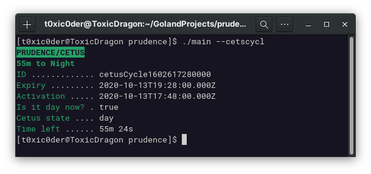
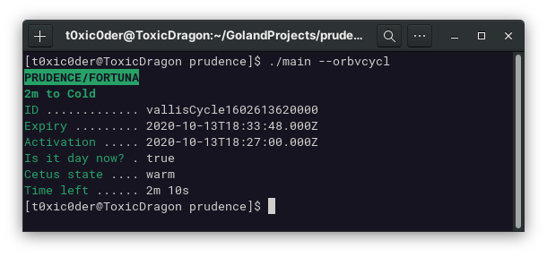
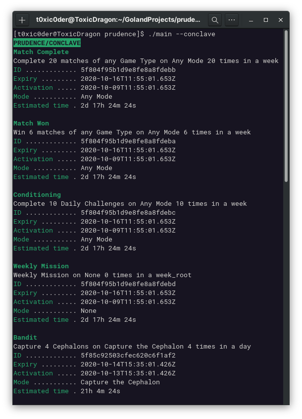
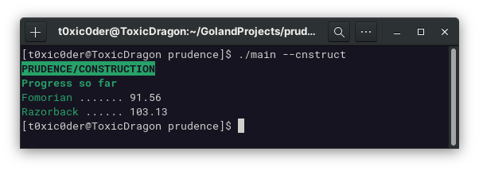
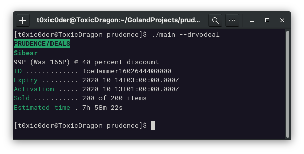

# prudence

An easy application to help me know when night falls at PoE so I can hunt eidolons 

[Find the repository here](https://github.com/t0xic0der/prudence/)

    
    
    
    

## Screenshots

- Know the state of Plains of Eidolon

- Know the state of Orb Vallis

- Know the details about Conclave

- Know the progress of construction

- Know the deals available from Darvo
