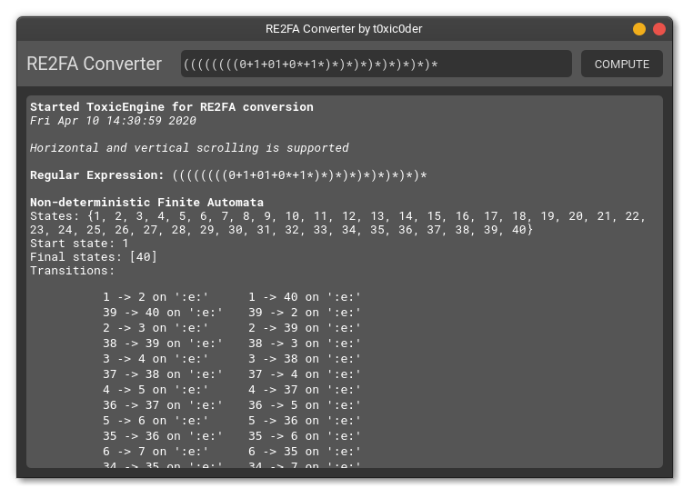

# RE2FA Converter
A Python GUI application for converting regular expressions to finite automata

[Find the repository here](https://github.com/t0xic0der/re2fa-converter/)

## In works


## How to use?
1. Install and upgrade **virtualenv** if not already done by executing ```pip3 install virtualenv --user```
2. Clone the repository on your local drive and make it your current working directory
3. Create a virtual environment by executing ```virtualenv venv```
4. Activate the virtual environment by executing ```source venv/bin/activate```
5. Install all dependencies for the project by executing ```pip3 install -r requirements.txt```
6. Run the project by executing ```python3 IndexApplication.py```
7. Type in any regular expression and watch it transform into a finite automata
8. When done tinkering, deactivate the virtual environment by executing ```deactivate```
9. Give stars to the repository if it was helpful

## Known bugs
1. Calculating minimized DFA will most likely result in a wrong answer.
2. Window will flicker on Wayland sessions. Try using Xorg as much as possible.

## Contribute
Fork, add, build and make a PR. You know the drill.
