# PharmaDB Client
A user-friendly GUI assistant with administrator privileges for PharmaDB

## Getting the GUI up and running
Make sure you have the following installed on your PC

* Tkinter
* Python 3 MySQL Driver
* Python 3.6 or above
* MySQL Community Server
* MySQL Workbench
* Administrator access
* Linux based OS

## Make sure
that all the downloaded files are in the same directory.

## Getting started
* Clone all the contents to your `/home` directory and open up `dataset_PharmaDB.sql` in MySQL workbench.
* Highlight and execute creation of the database. `create database PharmaDBTest`
* Switch over to the recently created database. `use PharmaDBTest`
* Highlight and execute creation of tables from line number 5 to 17 consecutively.
* The environment is ready. Execute `python3 client_app_lib.py` in terminal.

## Database required
Create a database in MySQL named "PharmaDBTest" consisting of the following relations

* **`TestManufacts`** - Relation about *Pharmaceutical Manufacturers*
* **`TestMedPrices`** - Relation about *Pharmaceutucal Product Prices*
* **`TestMedicines`** - Relation about *Pharmaceutical Products*
* **`TestProfitTab`** - Relation about *Active Transactions*
* **`TestTypeClass`** - Relation about *Product Classes*
* **`TestUserCreds`** - Relation about *User Credentials*
* **`TestWarehouse`** - Relation about *Warehouse Details*

## Screenshots

### Database connection
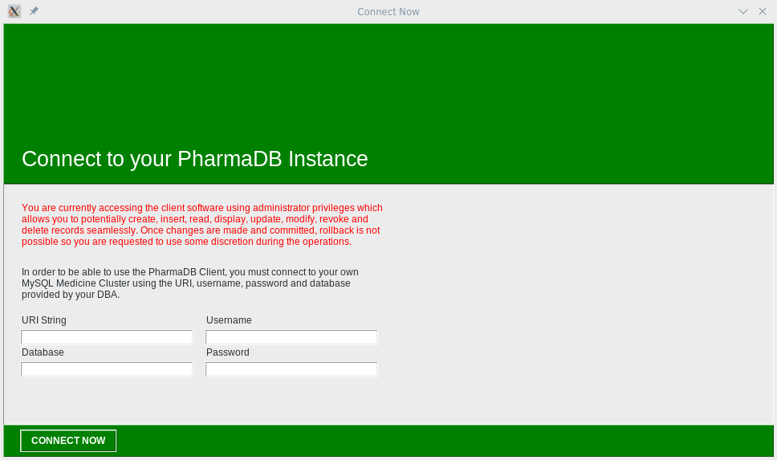

### Landing page
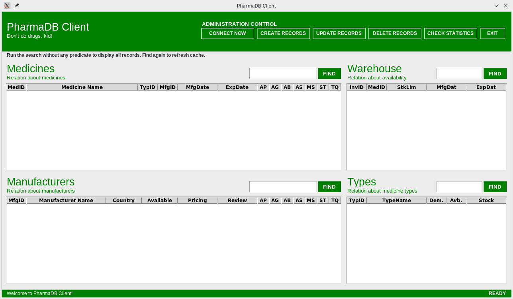

### Creation menu
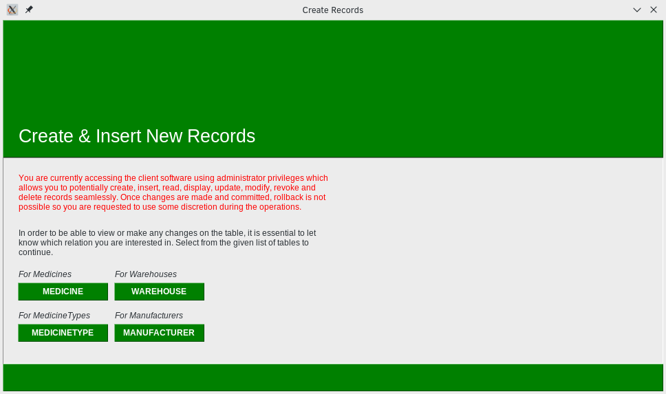

### Add new medicines
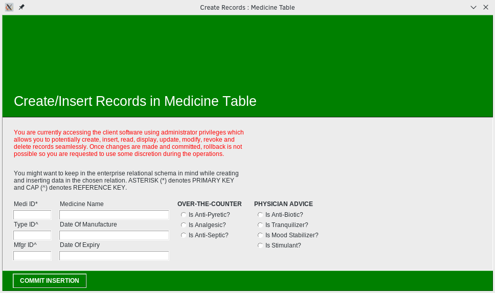

### Add new manufacturers
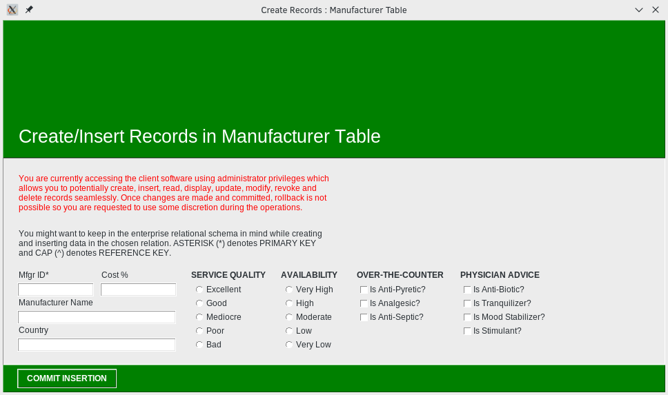

### Add new medicine types
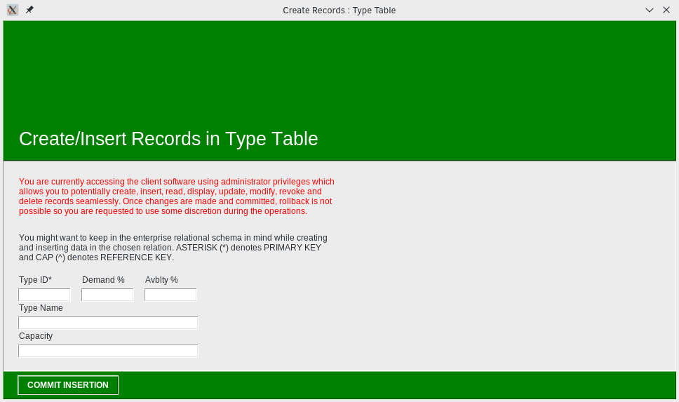

### Add new warehouses
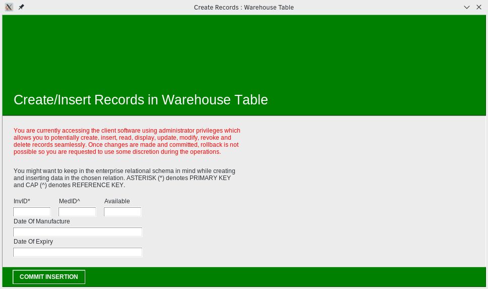

### Updating menu
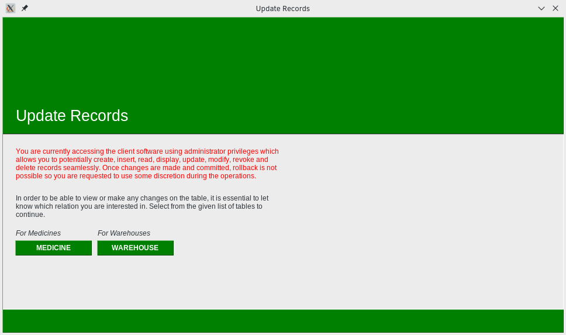

### Update existing medicines
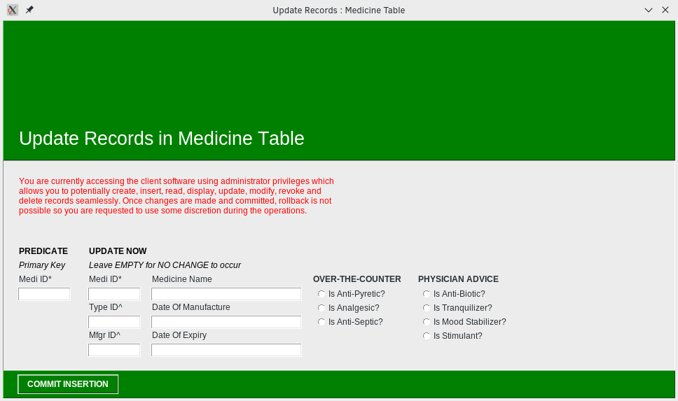

### Update existing warehouses
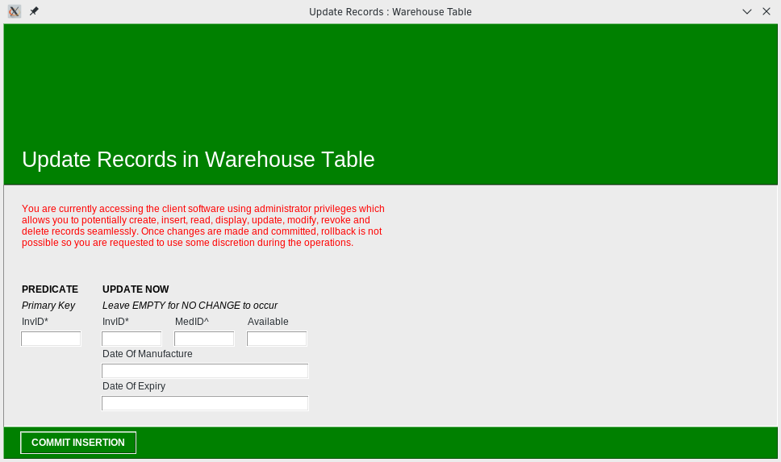

### Remove menu
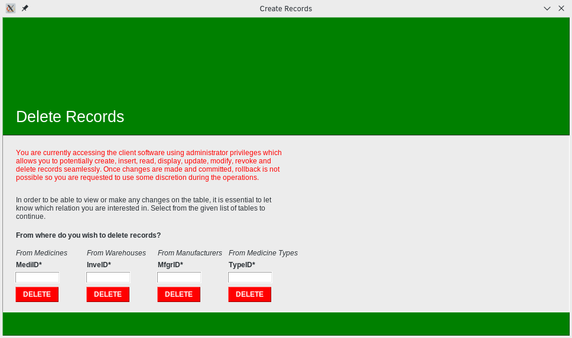

### Balance check menu
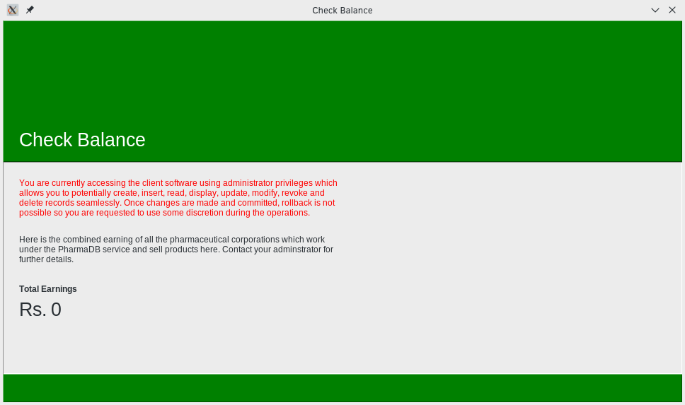

## Disclaimer
This application is not intended for use in production environment. It is still a work-in-progress and future updates may break your current operation. 