# ToxicIMS
Inventory Management System for Information Archives

## Requirements
1. PyQt 5
2. SQLite3 for Python 3
3. Qt Designer
4. Any code editor

## Introduction
This is a user friendly database solution for managing inventories of information archives. It uses Qt 5.12.1 GUI framework and SQLite3 database. One can easily perform CRUD operations for number of columns like **books**, **authors**, **publishers**, **categories**, **users** and much more along with possibilities of automation of operations like **lending**, **borrowing**, **transactions** etc.

## Screenshots

### Add new books
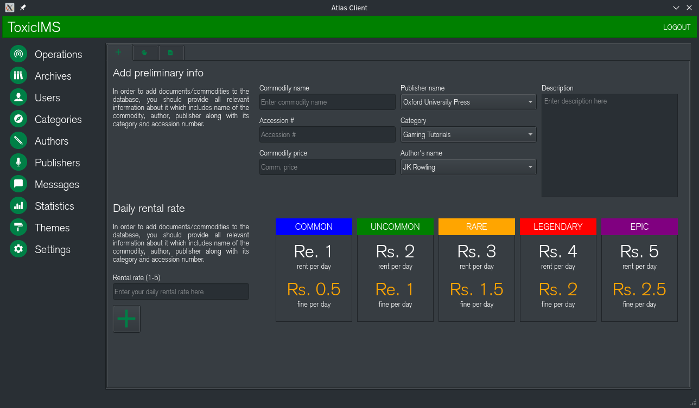

### Add new categories
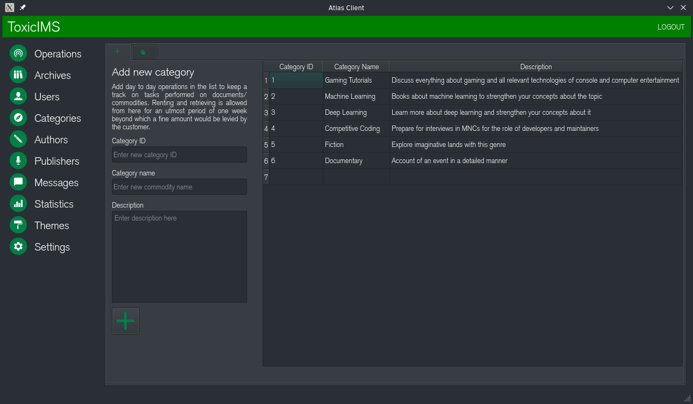

### Add new operations
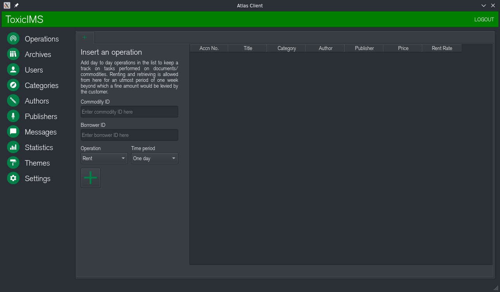

### Add new publishers
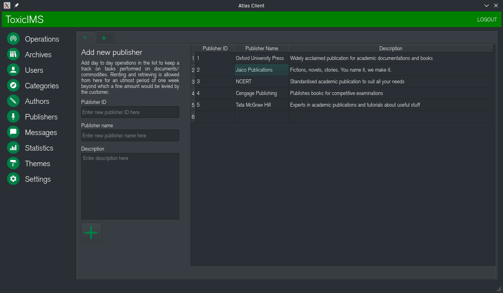

### Add new users
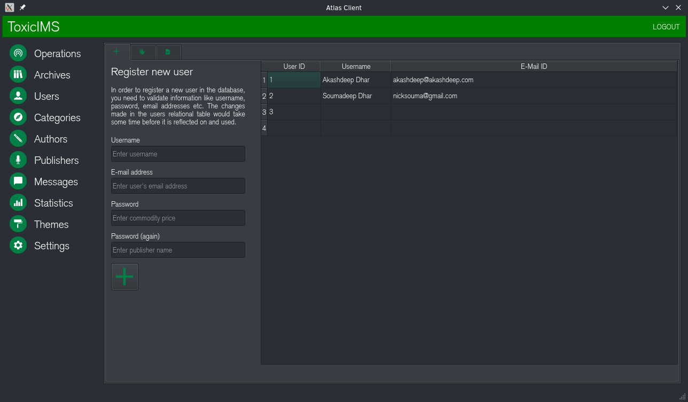

### Add new authors
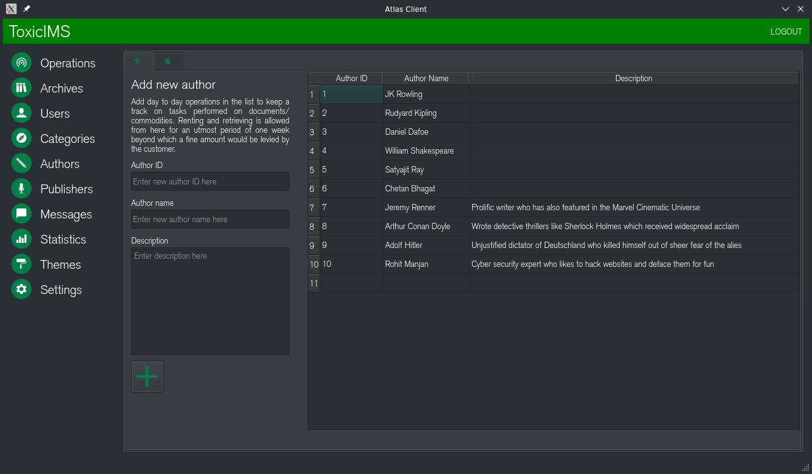

### Edit existing commodities
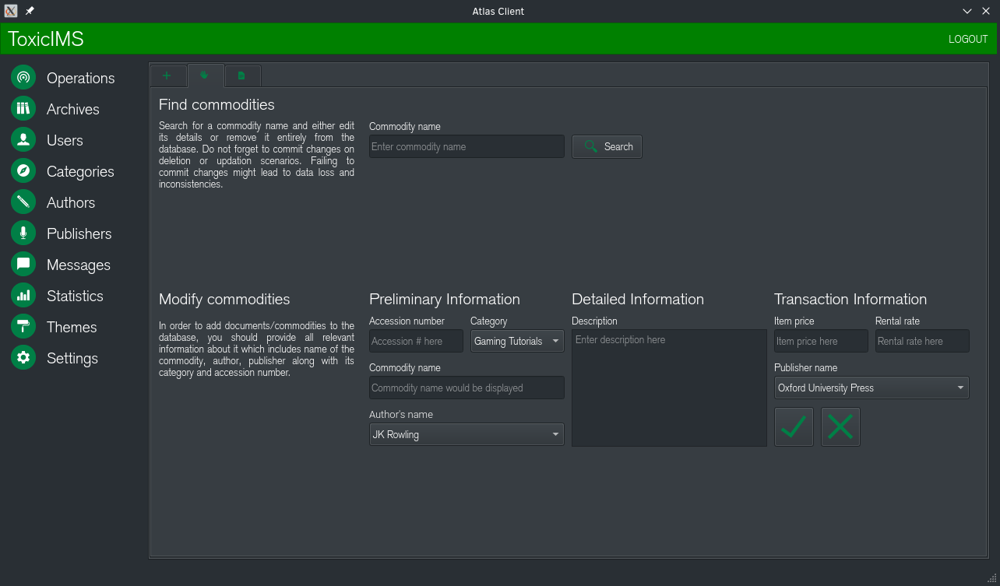

### Edit existing archives
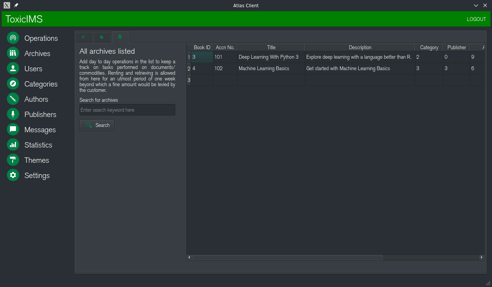

### Edit existing publishers
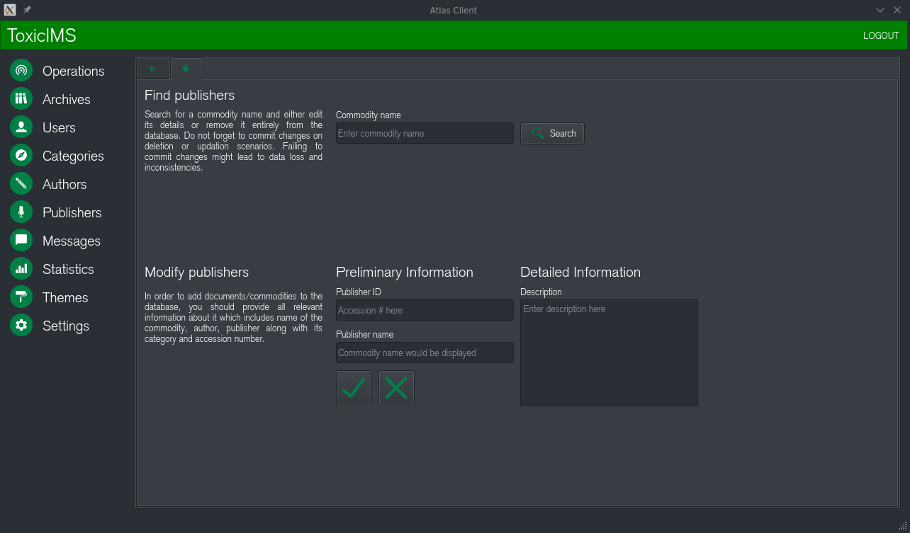

### Edit existing users
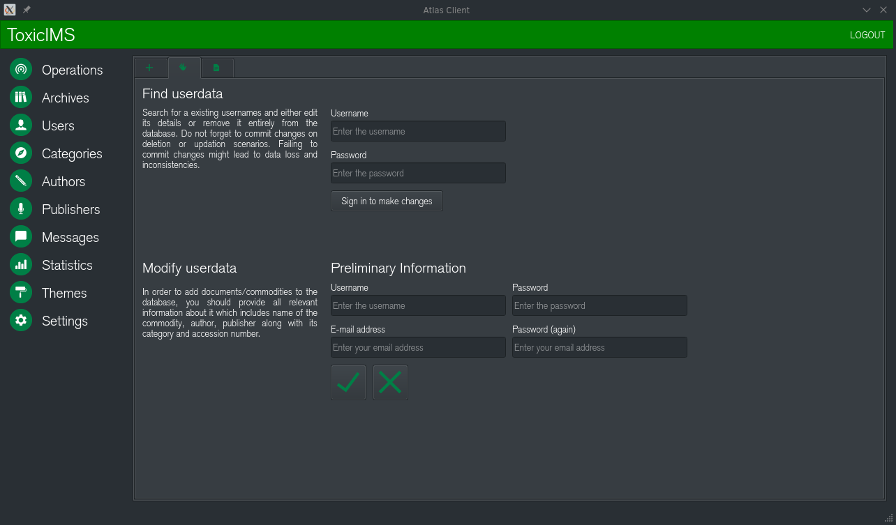

### Edit existing authors
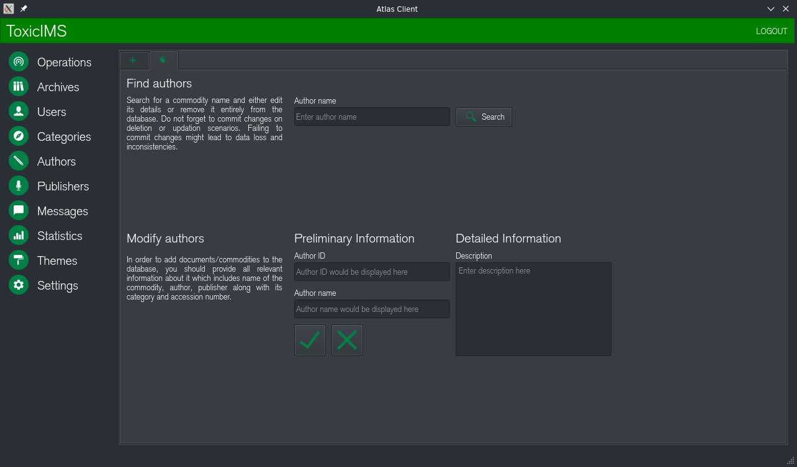

### About page
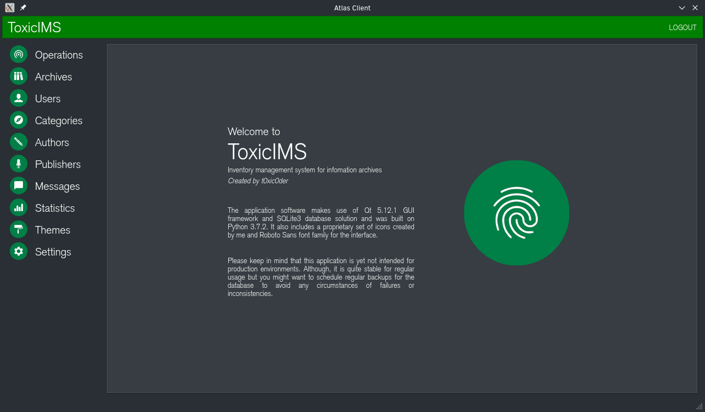

### Statistics menu (Experimental)
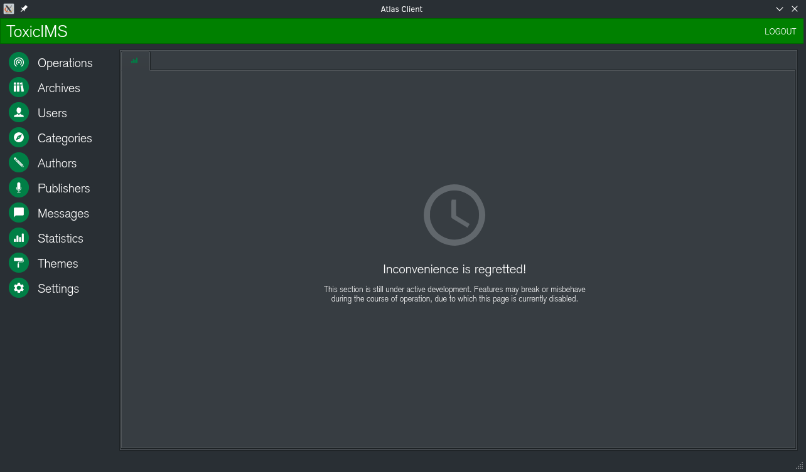

### Theming menu (Experimental)
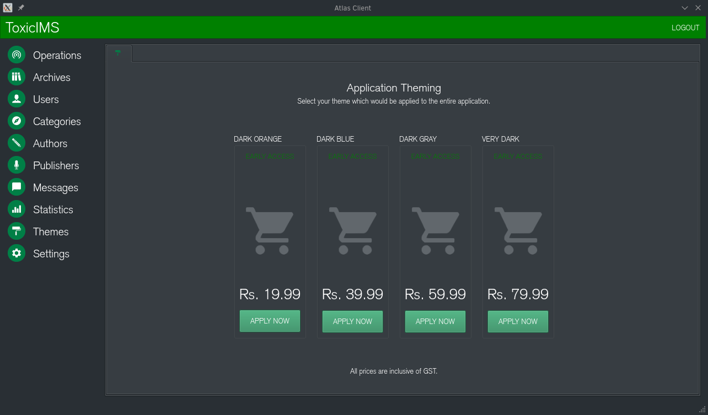