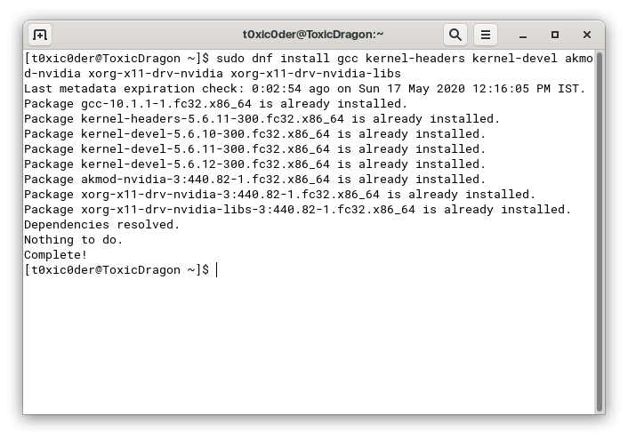

# Setting the NVIDIA GPU as primary (RPMFusion driver in Fedora 32 Workstation)

Just made it into Fedora 32 the day before yesterday and I found it to be just as good as people say it is. I own a laptop with Dual GPUs so obviously setting up Optimus correctly was a bit of an issue until I followed [this](https://rpmfusion.org/Howto/NVIDIA) guide by the word and it worked just great.

Now I have


The graphics are being detected correctly. I also followed [this guide](https://rpmfusion.org/Howto/Optimus), especially the part where it talks about NVIDIA Prime and the configuration did not work the way it should have. I wanted the entire desktop session to be rendered using NVIDIA GPU but it puts it to use only when I explicitly ask it to. The GNOME ends up looking ugly and feeling jittery slow due to the abysmal performance of the Intel UHD630 graphics.

I asked this question on 28th April 2020 on [ask.fedoraproject.org](https://ask.fedoraproject.org) but I ended up finding the answer on my own after numerous hours of searching. You can find the thread [here](https://rpmfusion.org/Howto/Optimus).


**Can anyone please walk me through the steps of how I can enable the NVIDIA GPU as the primary renderer for everything that gets displayed on the screen?**

**P.S.** I do not have an option to disable the integrated graphics in the BIOS menu.


As I figured out the solution for this by myself so I thought I would write this down for my own reference and for those who are facing the same issue. The instructions are available albeit in a somehow unclear manner so I will try my best to explain stuff as lucidly as possible and add references to other places if I am not able to explain correctly.

The objective is to enable NVIDIA GPU of an Optimus laptop all the time and use it for every single activity. If you are not planning on using NVIDIA GPU for rendering everything, you might want to stop reading this solution right now. You would be much better off reading the original article at [RPMFusion’s NVIDIA How-to guide](https://rpmfusion.org/Howto/NVIDIA).

As GNOME is one hell of a demanding desktop environment, it is no-brainer to use the discrete GPU for rendering the desktop and everything else. People may this feature call it NVIDIA PRIME or a Bumblebee derivative but to be honest, I did only few configurations and it worked fantastically after that.

## Step 1

Run
```text
sudo dnf update
```
once to update all your existing packages first.


## Step 2

Then you need to add the **RPM Fusion repository for NVIDIA drivers**. To do that, open up **GNOME Software** and click on the **hamburger menu** (three horizontal lines) on the top-right corner. Then click on **Software Repositories** from the dropdown menu. There you will see this.


Select **RPM Fusion for Fedora 32 - Nonfree - NVIDIA Driver** and **ENABLE** it. It requires elevated privileges so enter your password and it will be done.

## Step 3

Run
```text
sudo dnf update --refresh
```
to fetch all available package updates from the newly added repository.


## Step 4

Run
```text
sudo dnf install gcc kernel-headers kernel-devel akmod-nvidia xorg-x11-drv-nvidia xorg-x11-drv-nvidia-libs xorg-x11-drv-nvidia-libs.i686
```
to get the drivers from the RPM Fusion repository. This command will also end up installing its dependencies from both 32-bit and 64-bit architecture, taking upto almost 200-300MB of data download.



Note that your terminal output for the above would look significantly different from that of what I have posted here. It is not showing any kind of installation because I have it all installed already on my laptop.

## Step 5

Now that the drivers are all installed, you need to do one most important thing that would decide if your installation would work or not. You need to **wait for some 5-10 minutes** for the kernel modules to load up NVIDIA drivers. Moving on the next commands without waiting might lead to you facing the infamous black screen issue on login screen.

## Step 6

After the wait, execute
```text
sudo akmods --force
```
and
```text
sudo dracut --force
```
in succession. This would force the configuration to be read from the updated kernel modules which now have the NVIDIA drivers in them. Also, now is the best time to **turn off secure boot** if you have not already and are using a UEFI system for it would not allow loading up of the updated kernel module.

## Step 7

Wait for 3-5 minutes for the changes to take effect and then reboot your system. Once your system has started, go to the **About** page in the **Settings** application. You are likely to see the following output.


This effectively means that the driver installation was successful, leading to the detection of two distinct video accelerators - internal and discrete. If you wanted to use the internal GPU for basic rendering - that is to render the desktop environment and stuff and use the discrete GPU for specific applications, you can stop here.

But if you wish to entirely use your **discrete GPU** for both desktop environment and applications - read on the next steps and keep on implementing them as you go.

## Step 8

Now, in order to make all the rendering default to the discrete GPU, you need the follow the next steps very carefully. But first, you need to see if you really want to achieve this.

### Why should you do that?
1. Desktop environments as premium as GNOME, KDE and Deepin cannot afford to have the slightest of jitters. Your experience would be compromised if the animations are not smooth.
2. You are likely to have greater memory consumption as a part of the RAM would be used to store the video buffer. CPU load will also increase to handle the video processing tasks.

### Why should you not do that?
1. With the discrete GPU turned on and used all the time, the battery life is likely to go haywire here. It should not be a concern for those who constantly use their devices while plugged.
2. Increased generation of heat from the discrete GPU can be worrisome. You cannot quite play AAA-titles on Proton while keeping your laptop on your lap if you don’t want to get burnt.

## Step 9

Execute the following command to copy the render details for the X11 display server.
```text
sudo cp -p /usr/share/X11/xorg.conf.d/nvidia.conf /etc/X11/xorg.conf.d/nvidia.conf
```

Once done, open up the
```text
nvidia.conf
```
from the copy destination and edit it to add
```text
Option "PrimaryGPU" "yes"
```
to every section of it.

Open it using
```text
sudo nano /etc/X11/xorg.conf.d/nvidia.conf
```
and make changes.

The file should look like this. Do not panic if it looks sightly different.


Look closely, I have added that line in both the sections.

Save it using
```text
[Ctrl]+[S]
```
and exit out using
```text
[Ctrl]+[X]
```

## Step 10

Reboot your system again. We will run some tests in the next steps to see if it really worked or not.

## Step 11

Open up a terminal and type
```text
glxinfo | egrep "OpenGL vendor | OpenGL renderer"
```


If every configuration was done right, it should show up your discrete GPU and not the internal one.

Check in your Settings application. You would see something like this in the About page.


You would see a lot to tinker in your NVIDIA X Server Settings application. Also the GPU would show activity in its utilization percentage to signify that it is actually working.


## Step 12
If you were able to follow the instructions and come this far, you deserve a pat on your back. To be honest, a lot of my friends opt for Debian-based and Ubuntu-based distributions like Pop!_OS to ease the pain of installing NVIDIA drivers by themselves. Fedora is pure love and it is heart-breaking to see how limited documentation is available in this regard. As a consequence of minimal documentation and the futile pursuit of elitism, the community loses people to distributions which are much more friendlier to these aspects.

## References
This thread would go inert due to inactivity so even if I would more than love to answer questions and queries - I would not be able to. I am attaching the reference material so that if my steps do not work out for you - maybe theirs will. But feel free to PM me in case of doubts.

1. [RPMFusion's Optimus How-to Guide](https://rpmfusion.org/Howto/Optimus)
2. [RPMFusion's NVIDIA How-to Guide](https://rpmfusion.org/Howto/NVIDIA)
3. [GPU Activity Check](https://unix.stackexchange.com/questions/16407/how-to-check-which-gpu-is-active-in-linux)
4. [Optimus Prime on Fedora](https://www.reddit.com/r/Fedora/comments/bw4b0p/how_to_fedora_nvidia_prime/) (zvitaly’s response only)

Please for the love of everything holy  
Stay away from the writeup provided on this site  
[If-Not-True-Then-False's Fedora NVIDIA Guide](https://www.if-not-true-then-false.com/2015/fedora-nvidia-guide/)