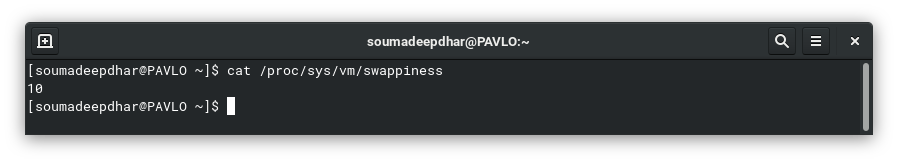
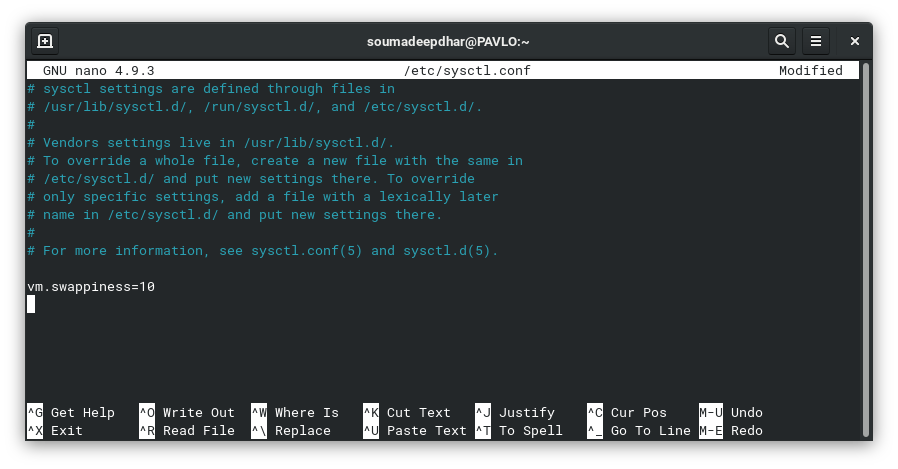

# Using RAM Efficiently by Reducing Swappiness Value

Let us now see how you can use your primary memory efficiently by reducing the swappiness value. Note that this guide is applicable for Fedora 32 and above only.

1.  **Before getting into modifying it, what is swappiness value?**  
    <p align="justify">Swappiness is a property for the Linux kernel that changes the balance between swapping out runtime memory, as opposed to dropping pages from the system page cache. Swappiness can be set to values between 0 and 100, inclusive. A low value means the kernel will try to avoid swapping as much as possible where a higher value instead will make the kernel aggressively try to use swap space.</p>

2.  **Why is "reducing" the swappiness value a good idea?**  
    <p align="justify">Suppose you have a system RAM with capacity of more than or equal to 16GB and a good frequency of 2400MHz or above - this should be more than sufficient to load entire programs on the memory and execute from there in most circumstances. Having a higher swappiness value in this scenario disregards all the good that the primary memory could have brought you and makes you depend on a much slower secondary memory device, as that is where the swap partition resides - thus causing a bottleneck. Reducing the swappiness value is a good idea as it would make the scheduler proactively use the primary memory as much as possible.</p>

3.  **Why is "increasing" the swappiness value a good idea?**  
    <p align="justify">Suppose you have a system RAM with capacity of less than or equal to 4GB and an okayish frequency of 2133MHz or lower - this is not at all sufficient to load even browsers completely on the memory and execute from there in most circumstances. Having a lower swappiness value in this scenario adds undue load on the primary memory which is undercapable and you are likely to frequently face out-of-memory errors due to such a configuration. The increased tendency to swap pages to the secondary storage device would allow execution of larger programs (with size larger than the primary memory) and increasing the swappiness value is thus a good idea.</p>

4. **How do I check current swappiness value?**  
    Simply execute the following command,
    ``` bash
    cat /proc/sys/vm/swappiness
    ```
    This would display the current swappiness value for your system which is **60** by default for Fedora.  
    Following is an example output.  
     

5. **How do I change swappiness value?**  
    Open `/etc/sysctl.conf` with a text editor of your choice.  
    For example  
    ``` bash
    sudo nano /etc/sysctl.conf
    ```
    Following is an example output.  
       
    Append the following line in the file, save changes and restart your system.  
      * If you have a DDR4 RAM with 8GB capacity or more and a good frequency of 2400MHz or above, add - `vm.swappiness=10`.  
      * If you have a DDR3/DDR4 RAM with 4GB capacity or less and an okayish frequency of 2133 MHz or less, you need not make any changes.  

---

This is a draft writeup for a candidate entry in Quick Docs - an issue for which you can find [here](https://pagure.io/fedora-docs/quick-docs/issue/292), awaiting triage.