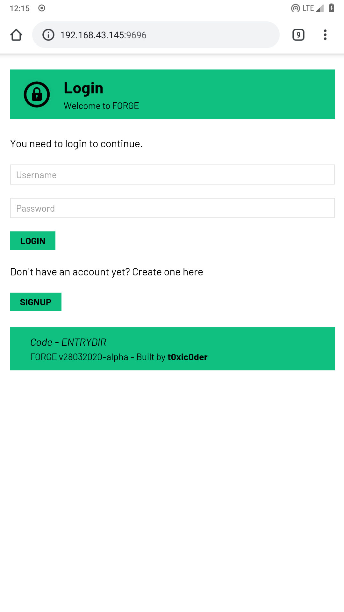
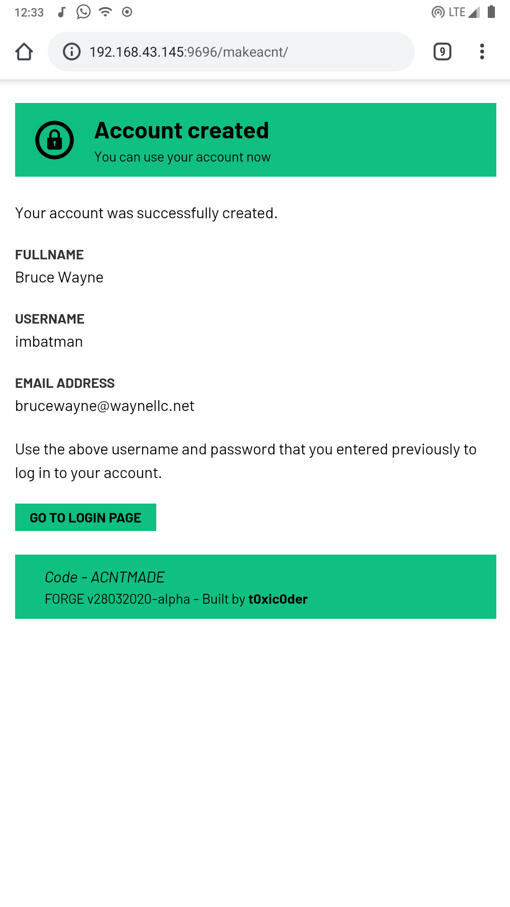
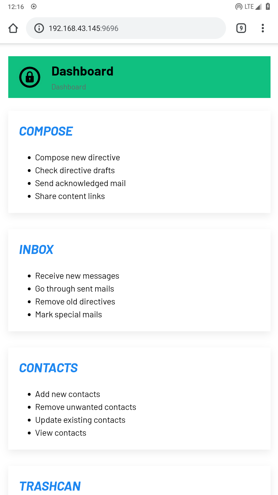
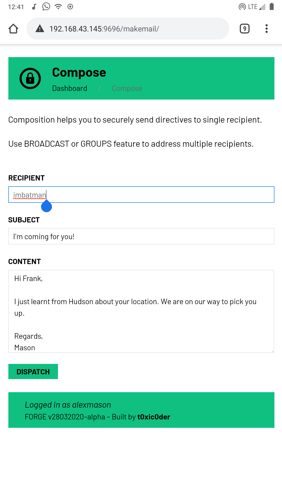
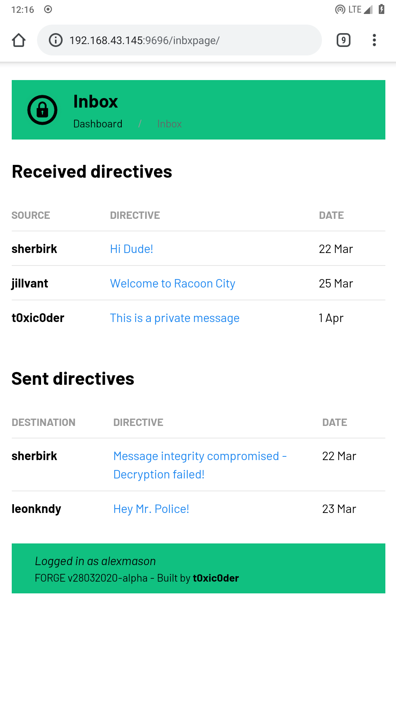
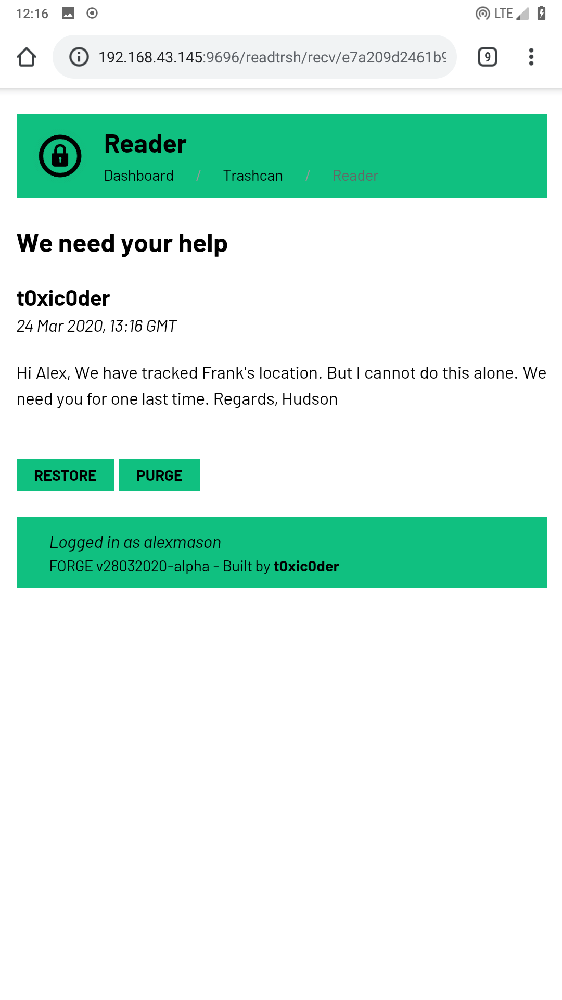
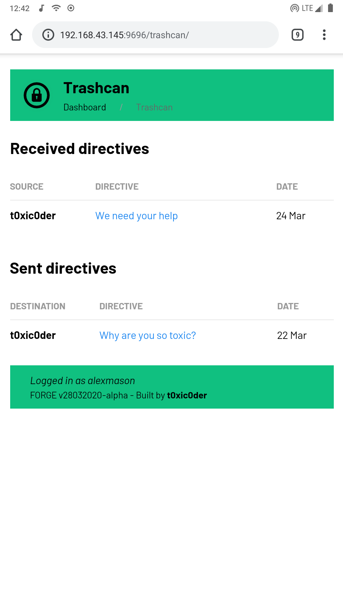
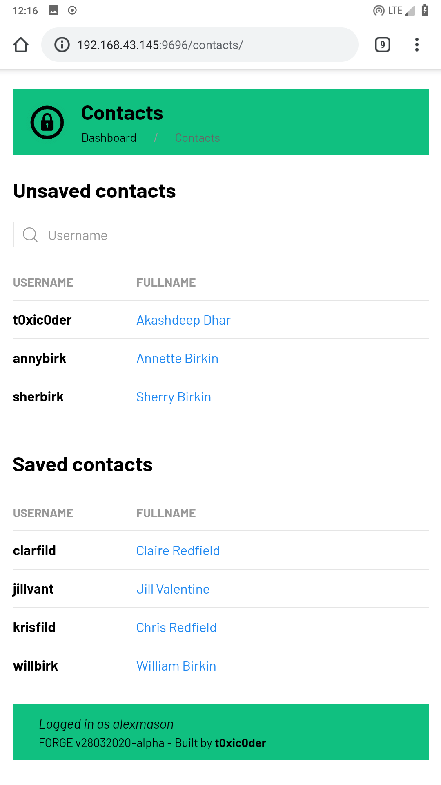
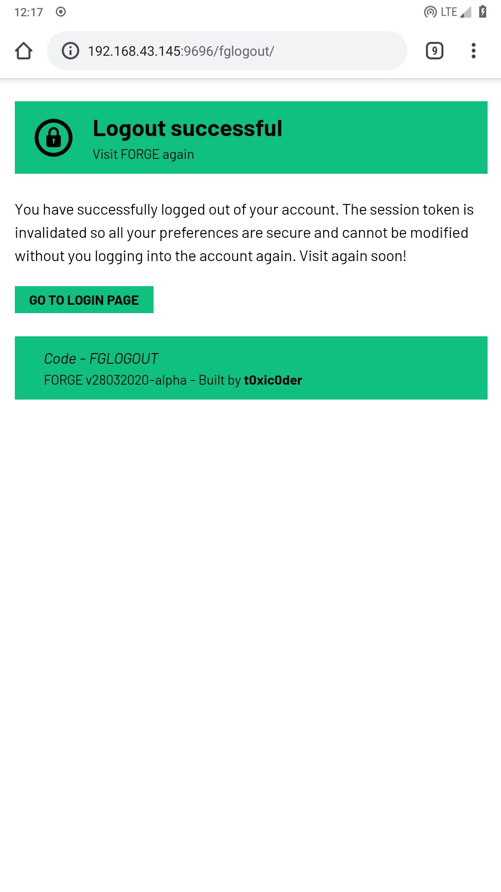
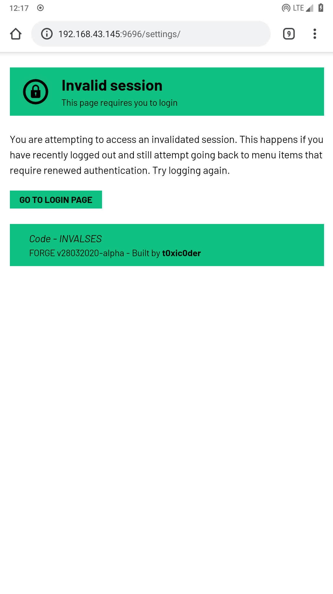

# FORGE
Forensics Oriented Reporting Group Under Encryption

## Achievement
> We made it to the top 10 projects in the 2020 HackTheCrisisIndia IDEAthon

## Ideology
**This project follows the belief of Sir Abraham Lincoln**
> You can fool *all* the people *some* of the time and *some* of the people *all* the time,  
> But you cannot fool *all* the people *all* the time.

## Introduction
FORGE or Forensics Oriented Reporting Group Under Encryption is a network system for secure transmission of directives among two or multiple authentic users. It uses asymmetric key cryptography to ensure an end-to-end encryption scenario.

## Features
* Can be easily adopted in any network using client-server model
* Directives are stored in eavesdrop-free encrypted format in the server
* Every user has a unique **64-byte PKCS identity** to recognize with
* Encryption uses a brute-force resistant *timestamp-based keypair generation*
* Directive subject and content storage in tamper-free *byte-index array*
* Asymmetric key cryptography - **2048-bit RSA** used for *directive protection*
* One-way encryption strategy - **512-bit SHA** used for *storing passwords*
* Unique signature for elements like contacts, directives and groups
* Group sharing uses double layer protection with group's own keypair
* Capable of **one-to-one directive sharing** using *composition*
* Capable of **one-to-many directive sharing** using *broadcast* and *groups*
* State-of-the-art session management and user access control

## Usage

### Server-side instructions
1.  Install and upgrade **virtualenv** if not already done by executing ```pip3 install virtualenv --user```
2.  Clone the repository on your local drive and make it your current working directory
3.  Create a virtual environment by executing ```virtualenv venv```
4.  Activate the virtual environment by executing ```source venv/bin/activate```
5.  Install all dependencies for the project by executing ```pip3 install -r requirements.txt```
6.  Run the project server by executing ```python3 app.py```
7.  When done tinkering, deactivate the virtual environment by executing ```deactivate```
8.  Give stars to the repository if it was helpful

### Client-side instructions
1. Open up a browser and visit ```<SERVER-IP-ADDRESS>:9696``` (default location)
2. Create account, login, follow people and send protected directives
3. Safely logout of your account once you are done using it
4. Give stars to the repository if it was helpful

## Screenshots

### Login

### Signup

### Dashboard

### Compose

### Inbox

### Reader (Inbox)

### Trashcan

### Reader (Trashcan)

### Contacts

### Logout

### Invalid session


## Changelog
**NOTE** : Project follows a rolling version control model  

### v18032020
* Built basic flow-of-control framework
* Elected UIKit CSS framework for look-and-feel
* Elected SQLite3 database for testing purposes
* Elected SHA512 as the default hashing method
* Designed `localuse` database schema (one-for-one)
* Designed `clouduse` database schema (one-for-many)
* Built login backbone
  * Added validation check for existing account
  * Enabled storing passwords as 512-bit SHA hash
  * Added login check by hash comparison
  * Created frontend for login page

### v19032020
* Elected RSA2048 as the default asymmetric encryption method
* Built signup backbone
  * Added validation check for existing account
  * Enabled storing passwords as 512-bit SHA hash
  * Enabled timestamp-based keypair generation
  * Enabled storing public key in `clouduse` remote database
  * Enabled storing private key in `localuse` local database
  * Added a 64-byte PKCS identity for user
  * Created frontend for signup page
  * Created frontend for login redirect
* Built dashboard backbone
  * Created frontend for dashboard page
  * Added link to compose page
  * Added link to inbox page
  * Added link to contacts page
  * Added link to trashcan page
  * Added link to broadcast page
  * Added link to settings page
  * Added link to logout

### v20032020
* Updated login backbone
  * Added validation check for empty username response
  * Added validation check for empty password response
* Updated signup backbone
  * Added validation check for empty username response
  * Added validation check for empty password response
  * Added validation check for empty email address
  * Added validation check for invalid email address
  * Added validation check for dissimilar passwords
* Built configuration system
  * Added `localuse` database credentials
  * Added `clouduse` database credentials
  * Added timekeeping metadata
  * Added centralized version info
  * Added centralized error handling routine

### v21032020
* Built compose backbone
  * Enable one-to-one directive sharing
  * Added validation check for existing account
  * Added receiver public key fetch function - sending
  * Added sender public key fetch function - saving
  * Enabled *subject* encryption for sending and saving
  * Enabled *content* encryption for sending and saving
  * Added timestamp-based 64-byte mail identity
  * Enable storage in byte-index array
  * Disabled remove flag by default for all directives
  * Created frontend for compose page
* Elected GMT for default timezone
* Built inbox backbone
  * Added convertor function for timestamp
  * Added private key fetch function - reading
  * Added convertor function for byte-index array
  * Enabled *subject* decryption for sent and received directives
  * Enabled *content* decryption for sent and received directives

### v22032020
* Updated compose backbone
  * Added validation check for empty recipient response
  * Added validation check for nonexistent recipient
  * Added validation check for empty subject response
  * Added validation check for empty content response
* Updated inbox backbone
  * Added sent directive fetching function
  * Added received directive fetching function
  * Added mail reader for single directive
  * Enabled moving to trashcan feature for directives
  * Created frontend for inbox page
  * Created frontend for mail reader page
  * Created frontend for delete-to-inbox redirect

### v23032020
* Updated inbox backbone
  * Corrected mail reader page reference
* Built trashcan backbone
  * Added convertor function for timestamp
  * Added private key fetch function - reading
  * Added convertor function for byte-index array
  * Enabled *subject* decryption for sent and received directives
  * Enabled *content* decryption for sent and received directives
  * Added removed sent directive fetching function
  * Added removed received directive fetching function
  * Added mail reader for single directive
  * Enabled restoring to inbox feature for directives
  * Enabled permanent purge feature for directives
  * Created frontend for trashcan page
  * Created frontend for mail reader page
  * Created frontend for restore-to-trashcan redirect
  * Created frontend for purge-to-trashcan redirect

### v24022020
* Built contacts backbone
  * Added unique identity for every contact list entry
  * Added validation check for saved contacts
  * Added validation check for empty search query
  * Added error handling for empty search results
  * Enabled *follow* feature - single-end contact creation
  * Enabled *unfollow* feature - single-end contact removal
  * Added function for fetching saved contacts
  * Added function for searching unsaved contacts
  * Added function for fetching details on single contact
  * Created frontend for contacts page
  * Created frontend for single contact view page
  * Created frontend for follow-to-contacts redirect
  * Created frontend for unfollow-to-contacts redirect
* Updated trashcan backbone
  * Handled undecryptable *subject* & *content* of directives
* Updated inbox backbone
  * Handled undecryptable *subject* & *content* of directives

### v25022020
* Overhauled template system with inheritance
  * Added master template without menubar
  * Added master template with menubar
* Optimization performed
  * Minimized login page
  * Minimized signup page
  * Minimized dashboard page
  * Minimized compose page
  * Minimized inbox listing page
  * Minimized inbox mail reader page
  * Minimized delete-to-inbox redirect
  * Minimized trashcan listing page
  * Minimized trashcan mail reader page
  * Minimized restore-to-trashcan redirect
  * Minimized purge-to-trashcan redirect
  * Minimized contacts listing page
  * Minimized single contact view page
  * Minimized follow-to-contacts redirect
  * Minimized unfollow-to-contacts redirect

### v26022020
* Layout optimizations performed
  * Obsoleted seperate templates for landing and user pages
  * Tested layout on multiple mobile devices
  * Obsoleted non-responsive navigation bar
* Sanity check
  * Added placeholder page for groups function
  * Added placeholder page for broadcast function
  * Added placeholder page for settings function

### v27022020
* Networking
  * Opened application for remote connections - `0.0.0.0:9696`
* Session management
  * Obsoleted dedicated session data storage
  * Fixed shared sessions bug with flask session support
  * Added better handling of invalid session

### v28022020
* Updated compose backbone
  * Added detection for send-to-self directives
  * Error handling for send-to-self directives
* Layout optimization perfomed
  * Replaced navigation with breadcrumb
  * Added CSS for condensed buttons and card layout
  * Added system code for alert pages
  * Moved user information to footer
* Documentation
  * Updated screenshots to `SCREENSHOTS.md`

## Contribute
The project is currently in diverse development process. The codebase needs cleanup, optimization and documentation so one may find it hard to get their hands into it. Feel free to contact me at akashdeep.dhar@gmail.com if you wish to contribute.
