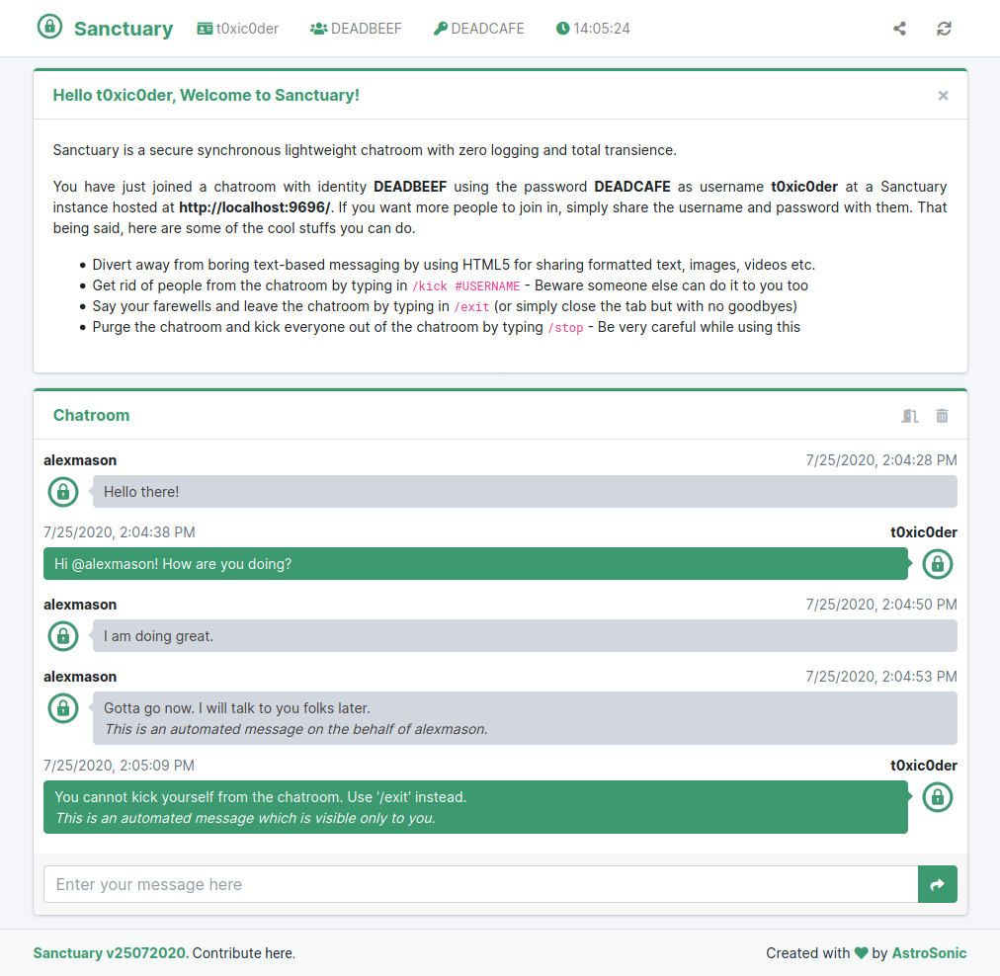

# Sanctuary
A secure synchronous lightweight chatroom with zero logging and total transience

[Find the repository here](https://github.com/astrosonic/sanctuary)

## Simply elegant

## Built on
* **WebSockets** for *low-level real-time, bidirectional and event-based communications*
* **Flask** for *web backbone, complex scalability and WSGI layer*
* **Click** for *creating beautiful command line interfaces in a composable way*

## Features
* Provides real-time conversation using synchronous WebSocket objects
* Ultralight on system resources - Approx. 2MB over Python runtime
* Zero logging or data storage to minimize database vulnerabilities
* Accessible across internet with both IPv4 and IPv6 support by-design
* No-frills user alias and random-generated keys for chatroom creation
* Hardened protection using password-based AES message encryption
* Leave the chatroom (with farewell) using the dedicated `/exit` call
* Purge the chatroom for every member using the dedicated `/stop` call
* Kick specific members from chatroom using the dedicated `/kick` call
* Whisper messages to specific members using the dedicated `/purr` call
* Refresh, close tab, logout, kick users or purge chatroom to cover tracks
* Transient chatrooms stay valid as long as at least one user is present
* Complete support for HTML5 formatting tags in conversations
* Lightweight and responsive - hence, usable across multiple devices
* State-of-the-art active chatroom and user session management

## Compatibility
This has been tested to work on

1. Generic PCs (`x86_64`)
    - Fedora, Ubuntu, Arch Linux ARM and Debian have been tested.
2. Raspberry Pi 4B (`aarch64`, `armhf`)
    - Arch Linux ARM, Raspberry Pi OS, Raspberry Pi OS Lite, DietPi, Manjaro ARM and Ubuntu ARM have been tested.
3. Raspberry Pi 3B and 3B+ (`aarch64`, `armhf`)
    - Arch Linux ARM, Raspberry Pi OS, Raspberry Pi OS Lite, DietPi and Ubuntu ARM have been tested.
4. Raspberry Pi Zero W (`armv6`)
    - Arch Linux ARM, Raspberry Pi OS, Raspberry Pi OS Lite and DietPi have been tested.

There are a lot of GNU/Linux distributions I could not test for - due to the lack of time and the amount of effort it takes to test it all everywhere. Though, it is worth noting that any GNU/Linux distribution based on the ones listed above should inherently work.

## Vulnerabilities

As most of the functions and routines have been implemented on the client-side to reduce the weight and complexity of the server-side code, the chatroom is vulnerable to monkey patching. Though the risk of information breach has been significantly minimized with the introduction of AES-based hardened protection, still it is highly recommended not to share confidential and sensitive information over the chatrooms. In such a state, it can be used for all kinds of conversation and as long as the chatroom is not opened up to the internet, you should not have to worry about any vulnerabilities.

## Disclaimer

When you use Sanctuary - you agree to not hold its contributors responsible for any data loss or breach that may occur due to the use of this chatroom application. You agree that you are aware of the experimental condition of Sanctuary and that you would want to use it at your own risk.

## Contribute

You may request for the addition of new features in the <a href="https://github.com/t0xic0der/sanctuary/issues">issues</a> page but as the project is singlehandedly maintained - it might take time to develop on them. Please consider forking the repository and contributing to its development.

