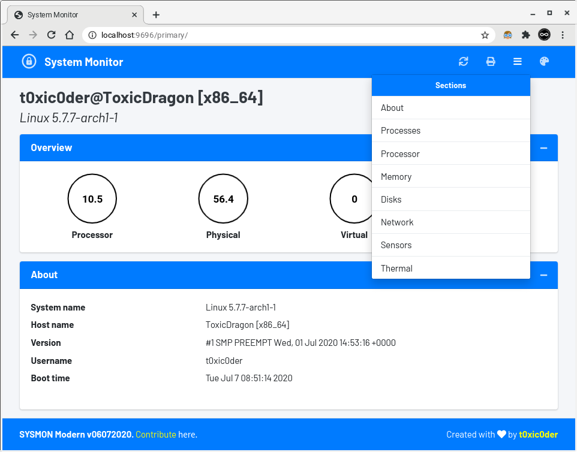
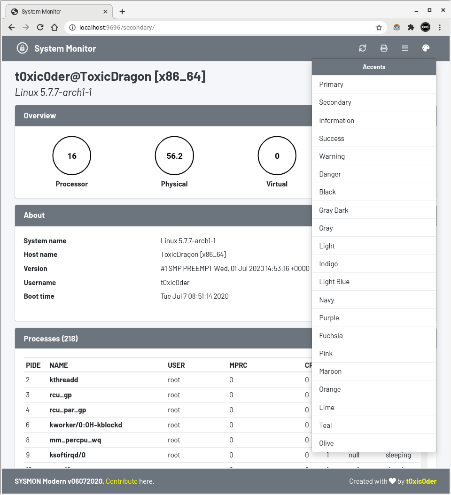
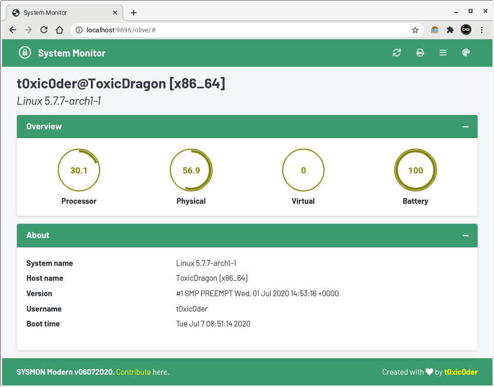
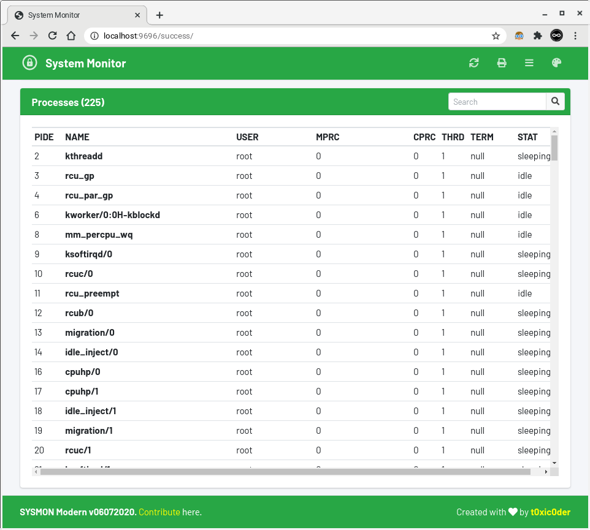
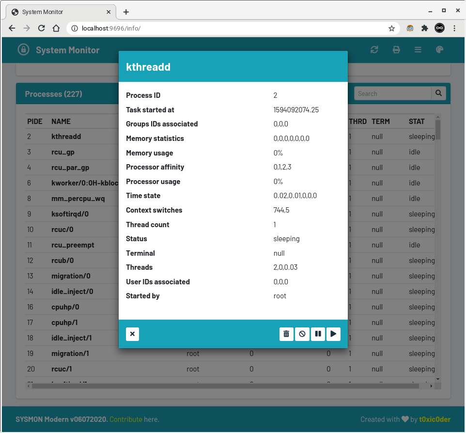
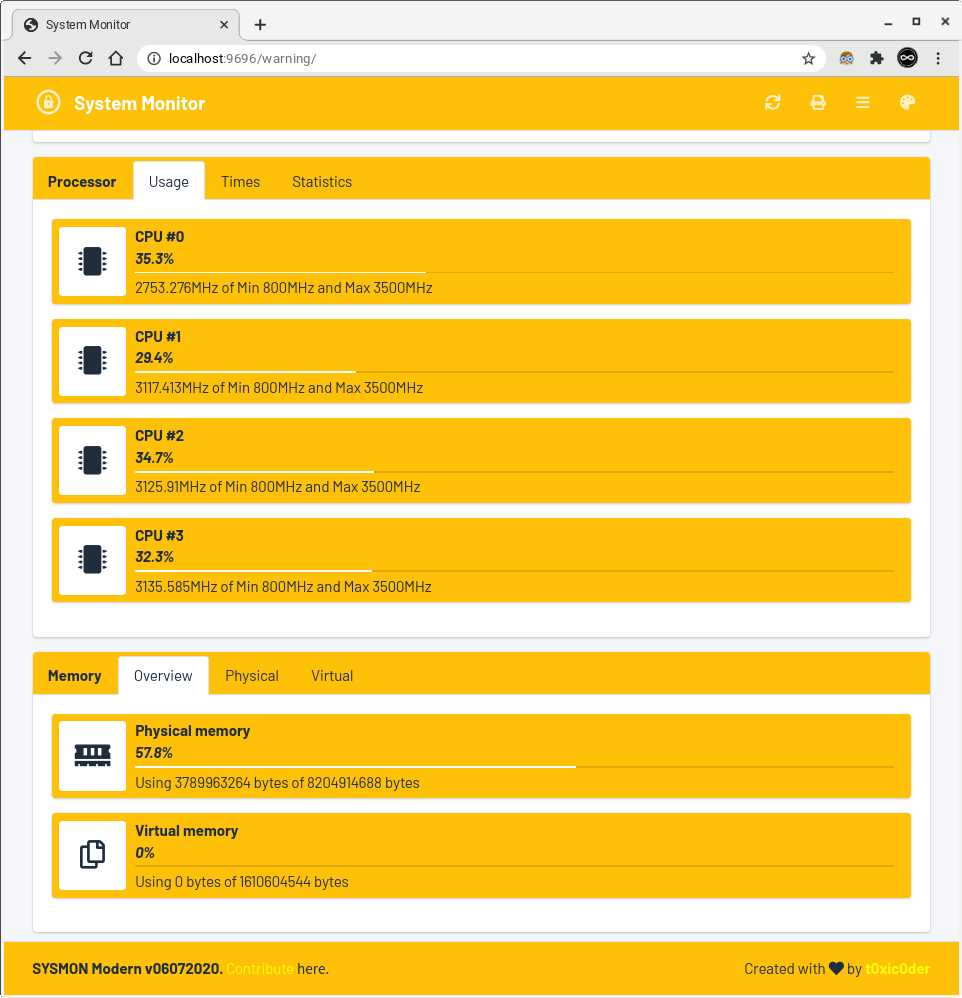
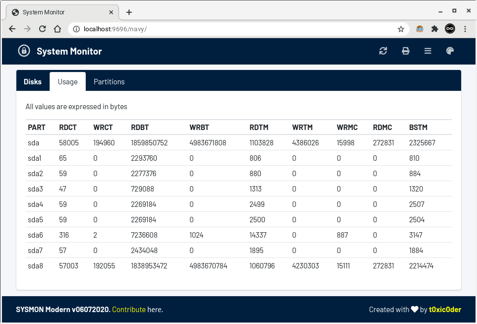
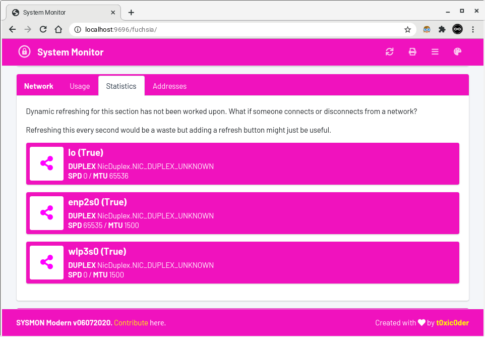
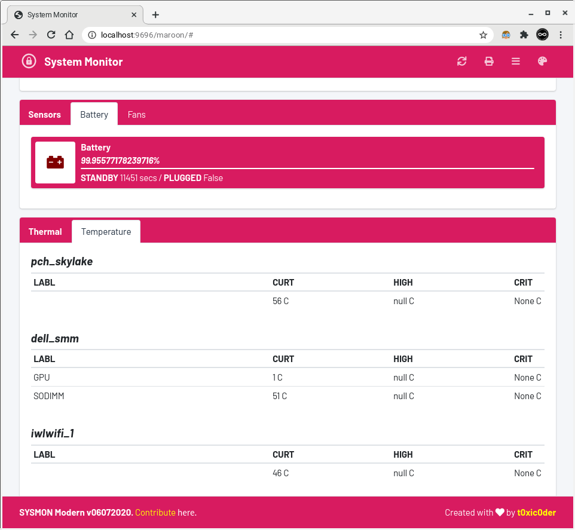

# SYSMON
An intuitive remotely-accessible system performance monitoring and task management tool for servers and headless Raspberry Pi setups

[Find the repository here](https://github.com/t0xic0der/sysmon)

## Good news!
WebStation SYSMON was featured in to author's [Reddit article](https://www.reddit.com/r/raspberry_pi/comments/htwe0o/i_have_created_an_intuitive_remotelyaccessible/) - followed by a [news article](https://www.tomshardware.com/news/manage-your-headless-raspberry-pi-remotely-from-a-web-browser) at Tom's Hardware. It is now featured in the [Awesome RPi](https://github.com/thibmaek/awesome-raspberry-pi) list too.

## Use-cases
- For people having home or enterprise servers with lower system specifications and complexity
- For people having headless setup of Raspberry Pi (or any other single board computer of the kind)
- For people looking for a relatively easy-to-understand and user-friendly system management tool
- For people wanting to control devices from mobile phones, chromebooks and smart TVs (with browser)

## Features
- Simplistic implementation of asynchronous periodic AJAX calls to fetch information
- Relatively low overhead from the server during stat (approx. 4MB over Python 3 runtime usage)
- Easy and flexible customization of interface by replacing the assets with your own
- Tweakable refresh times for dynamic information with endpoints powered by **`psutil`**
- Report printing and dynamic refreshing buttons available at disposal
- Hybrid cross-client theming engine built with upto 21 supported theming options
- Complex process management with per-task **`TERMINATE`**, **`KILL`**, **`SUSPEND`** and **`RESUME`** operations

## Table of contents
2. [Notice](https://github.com/t0xic0der/sysmon/wiki/Notice)
3. [Installing on Raspberry Pi](https://github.com/t0xic0der/sysmon/wiki/Installing-on-Raspberry-Pi)
4. [Installing on a Generic PC](https://github.com/t0xic0der/sysmon/wiki/Installing-on-a-Generic-PC)
5. [Screenshots](https://github.com/t0xic0der/sysmon/wiki/Screenshots)
6. [Things to do next](https://github.com/t0xic0der/sysmon/wiki/Things-to-do-next)
7. [Bugs](https://github.com/t0xic0der/sysmon/wiki/Bugs)

## Notice
1. The binary packages are architecture-bound. Pick the binary which is compatible with your system.
    1. **`armv6`** - Raspberry Pi Zero W and other such devices. The binaries for this architecture is currently unavailable but you can simply install the daemon by following the steps provided in the "Using the script" section.
    2. **`armhf`** - Raspberry Pi 2, Raspberry Pi 3B, Raspberry Pi 4B and other such devices. The binaries for this architecture is currently unavailable but you can simply install the daemon by following the steps provided in the "Using the script" section.
    3. **`aarch64`** - Raspberry Pi 3B, Raspberry Pi 4B and other such devices. The binaries for this architecture is currently unavailable but you can simply install the daemon by following the steps provided in the "Using the script" section.
    4. **`x86_64`** - Generic PCs an laptops. The binaries for this architecture are available for use and the also support "Using the script" way of installation.
2. The script from the upstream consist of all the leading-edge changes so advanced users are actually recommended to use that over prepackaged binaries which are packaged periodically.
3. I would be uploading the executable binaries very soon for the `armv6`, `armhf` and `aarch64` architectures. (Make it happen sooner by forking the project and contributing)

## Screenshots
- Section Picker [Primary]

- Cool 21 Theming Options [Secondary]

- Overview and About Section [Olive]

- Process Listing [Success]

- Task Management Modal [Information]

- Processor and Memory Overview [Warning]

- Disk Usages Overview [Navy]

- Network Statistics Overview [Fuchsia]

- Sensors and Thermal Overview [Maroon]

## Things to do next
- `[X]` Write driver code and endpoint access code for **Processor** page
- `[X]` Write client-side Jinja template and AJAX calls for **Processor** information
- `[X]` Write driver code and endpoint access code for **Memory** page
- `[X]` Write client-side Jinja template and AJAX calls for **Memory** information
- `[X]` Write driver code and endpoint access code for **Disks** page
- `[X]` Write client-side Jinja template and AJAX calls for **Disks** information
- `[X]` Write driver code and endpoint access code for **Network** page
- `[X]` Write client-side Jinja template and AJAX calls for **Network** information
- `[X]` Write driver code and endpoint access code for **Sensors** page
- `[X]` Write client-side Jinja template and AJAX calls for **Sensors** information
- `[X]` Write driver code and endpoint access code for **About** page
- `[X]` Write client-side Jinja template and AJAX calls for **About** information
- `[X]` Write driver code and endpoint access code for **Thermal** page
- `[X]` Write client-side Jinja template and AJAX calls for **Thermal** information
- `[X]` Write driver code and endpoint access code for **Processes** page
- `[X]` Write client-side Jinja template and AJAX calls for **Processes** information
- `[ ]` Implement process search feature using the search bar (For now, it is just a placeholder)
- `[X]` Add capacity to **TERMINATE/KILL/SUSPEND/RESUME** etc. tasks from the modal
- `[ ]` Highlight useful information in a much less granular manner
- `[ ]` Add data visualization with line graph, bar graph and donut charts
- `[X]` Cleanup asynchronous calls and optimize them for speedup
- `[ ]` Add element in the frontend to help modify refresh rate from the frontend
- `[X]` Cleanup decorators in backend and optimize them for efficiency
- `[ ]` Add a documentation about theming guidelines
- `[X]` Add client-side theming option using Javascript, unretained across sessions
- `[X]` Add JQuery dependencies to be loaded up from local storage
- `[X]` Add custom font dependencies to be loaded up from local storage
- `[X]` Minimize CSS/JS dependencies and remove those which are unused
- `[ ]` Add monotype fonts for numeric values
- `[ ]` AJAX calls should replace the value of a `` element only
- `[X]` Include functionality of server-side theming using Jinja
- `[X]` Clean up fetches which require creation and population separately
- `[X]` Limit endpoints to ONE by dispersing all information from single endpoint
- `[ ]` Include JSON (or YAML) based customizations for enabling/disabling sections
- `[X]` Add a PRINT document button at the top-right corner of the UI
- `[X]` Prevent text-selection/drag-drop capabilities in the UI
- `[ ]` Make a `document.location.href` for external links and ensure opening in new tab
- `[X]` Add dynamic refreshing functionality to disk partitions and network interfaces sect
- `[ ]` Fix responsiveness in cards for disk partition listing
- `[ ]` Trim numerical information to have much lesser accuracy
- `[ ]` Correct tabinations and code sanity in the client-side code
- `[ ]` Add functionality to switch the units for thermal data between celsius and fahrenheit
- `[ ]` Add an obligatory dark mode feature (for everybody else has it now)
- `[ ]` Change `onclick` highlighting color on dropdown menus (It is by-default `primary` for all accents)
- `[X]` Package it in a binary file with [`click`](https://click.palletsprojects.com/en/7.x/) to set command-line options
- `[X]` Make the binary (along with command-line options) usable as a `systemd` service
- `[ ]` Add user login feature as with complex process management, control cannot be left open
- `[X]` `[Would not be implemented as it breaks tab-switching feature]` Replace all card tabs `anchors` with `document.location.href` attributes
- `[ ]` Replace all `getElementById` with JQuery methods for speed up
- `[ ]` Hide resume button for processes already running and show resume for only `STOPPED` tasks
- `[ ]` Add tooltips for the task management buttons
- `[ ]` Add documentation about the various attributes and columns in table in another tab (per card)
- `[X]` Make the server be visible across the internet using IPv6 addresses
- `[ ]` Add driver function in a class format per section of details/actions
- `[ ]` Rewrite asynchronous calls with barebones WebSocket protocol for even lesser overhead
- `[ ]` Provide for viewing performance of multiple devices through single web-interface

## Bugs
- May require hard refreshing (**`Ctrl+Shift+R`**) followed by a normal refresh (**`Ctrl+R`**) to get proper data in knob
- Responsiveness is broken in cases where the line follows on to be too long without spaces
- CSS colors specified by the boilerplate do not match with the one specified in the standard
- The process modal does not refresh - data shown in the modal is at taken at the time of opening
- Multiple data elements are expressed in uncannily long, bigger and unnecessary accuracies
- Section references scroll up and inconveniently hide behind the persistent top bar
- Requires a short wait before the task management modal can be of use for the same process
- Some information overflow out of the task management modal - Wrap must be implemented
- Multiple calls made per second by the JavaScript engine can cause slow down in some browsers
- Network statistics and addresses are not actively refreshed. What if someone disconnects or reconnects?
- Disk partition details are not actively refreshed. What if someone pulls out or pushes in a drive?
- Scrollbar disappears in Chrome (intended behaviour) while not so on Firefox (unintended behaviour)

## Contribute
You may request for the addition of new features in the [issues](https://github.com/t0xic0der/sysmon/issues) page but as the project is singlehandedly maintained - it might take time to develop on them. Please consider forking the repository and contributing to its development.
